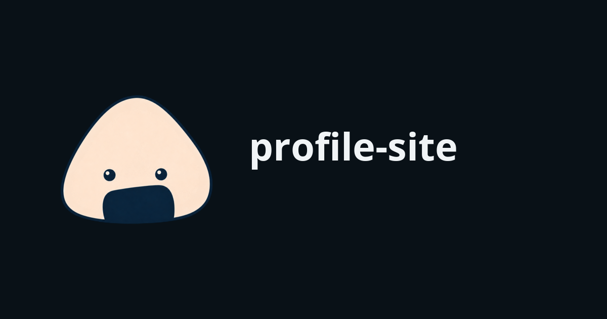

# soltonigiri profile site



日本語・英語に対応した、Cloudflare Pages上のプロフィールサイトです。

- Production: https://soltonigiri.pages.dev/
- Runtime: static assets
- Node.js: 22（GitHub Actionsと同じバージョン）

## セットアップと起動

```bash
npm ci
npm run dev
```

`http://localhost:8788`でローカルサイトが起動します。`npm run dev`は`public/`を配信します。

## 構成

```text
public/
  index.html                 日本語版
  en/index.html              英語版
  script.js                  おにぎりの動作、年表示
  style.css                  共通スタイル
  assets/immutable/          本番配信用のAVIF・WebP・SVG
tests/site.spec.js           Playwright E2E・アクセシビリティテスト
scripts/lighthouse.mjs       Lighthouse検査
wrangler.jsonc               Cloudflare Pages設定
```

## テスト

```bash
# HTML、JavaScript、内部リンク
npm run check

# Wranglerのテストサーバーを自動起動してPlaywrightを実行
npm run test:e2e
```

Lighthouseは、先に別ターミナルでローカルサーバーを起動してから実行します。

```bash
npm run dev
npm run test:lighthouse
```

GitHub Actionsでは、`npm run check`、Playwright E2E、LighthouseをNode.js 22で実行します。

## デプロイ

Cloudflare Pagesプロジェクト名は`soltonigiri`、配信ディレクトリは`public/`、本番ブランチは`main`です。GitHub連携では`main`の更新が本番デプロイになります。

Wranglerから明示的に本番へデプロイする場合は、認証先を確認してから実行します。

```bash
npx wrangler whoami
npx wrangler pages deploy public --project-name soltonigiri --branch main
```

デプロイ後は、返されたdeployment URLとProduction URLの両方を確認します。

## ライセンス

`public/assets/`を除くソースコードは[MIT License](./LICENSE)で公開しています。画像、ビジュアルアイデンティティ、第三者のロゴ・商標はMIT Licenseの対象外です。詳細は[NOTICE.md](./NOTICE.md)を参照してください。
