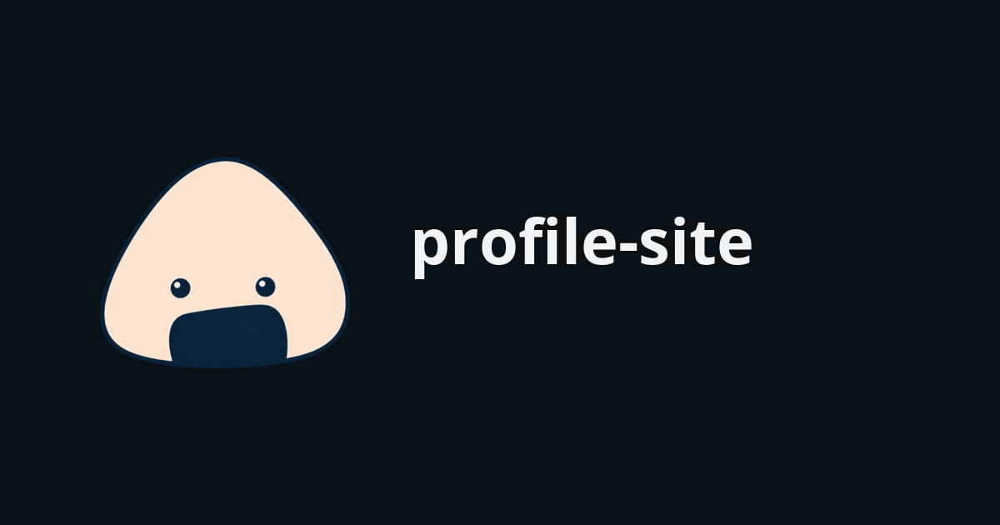

# soltonigiri profile site



日本語・英語に対応した[プロフィールサイト](https://soltonigiri.pages.dev/)です。`public/`の静的ファイルをCloudflare Pagesで配信します。

## 開発

Node.js 22以上で実行します。

```bash
npm ci
npm run dev
```

[localhost:8788](http://localhost:8788)で確認できます。日本語版は`public/index.html`、英語版は`public/en/index.html`です。スタイルとJavaScriptは共通です。

## 検証

```bash
npm run check
npx playwright install chromium
npm run test:e2e
```

HTML・JavaScript・内部リンクと、ブラウザ上の操作・表示・アクセシビリティを確認します。

Lighthouseは、別ターミナルで`npm run dev`を起動してから`npm run test:lighthouse`で実行します。

## デプロイ

Cloudflare Pagesのプロジェクト名は`soltonigiri`、配信ディレクトリは`public/`です。GitHub連携では`main`の更新時に公開します。手動で公開する場合は次を実行します。

```bash
npx wrangler pages deploy public --project-name soltonigiri --branch main
```

## ライセンス

`public/assets/`を除くソースコードは[MIT License](LICENSE)です。画像、ビジュアルアイデンティティ、第三者のロゴ・商標の扱いは[NOTICE.md](NOTICE.md)を参照してください。
